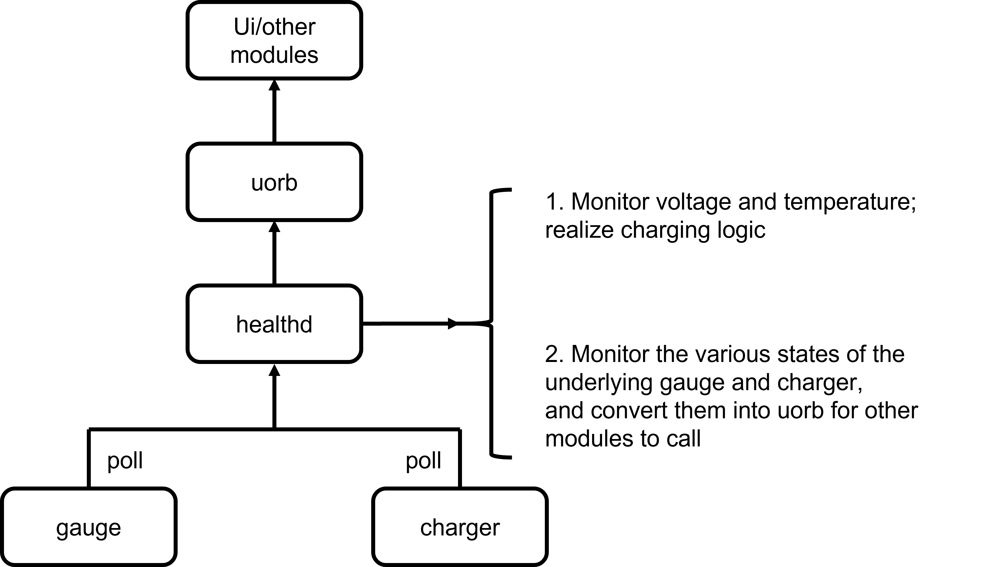
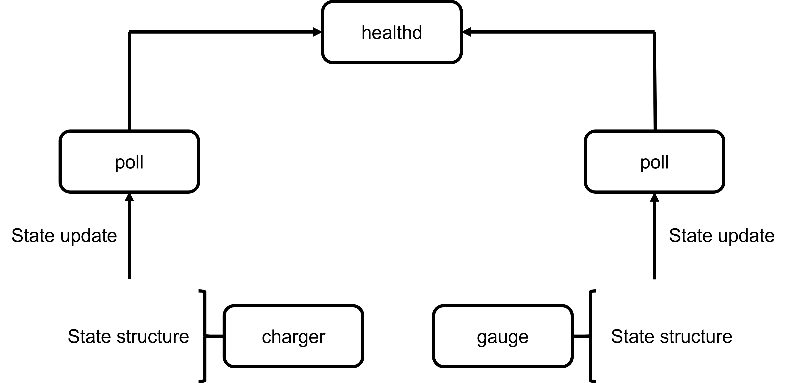

# Healthd module

`Openvela healthd` publishes health detection modules such as battery charging status, charging voltage and current, and battery temperature through uORB. The Healthd module mainly senses the changes of `mask` through all device nodes in the `/dev/charge/` directory under the `poll` system, obtains the changed parameters and publishes them through uORB.

## Battery chip driver
For different battery chip drivers, the following requirements are required for the framework:

1. The device nodes registered by the battery chip need to be in the `/dev/charge/` directory.

2. The battery chip driver must implement parameter change perception notification, and support the upper layer to access through `poll` in the process.

## Healthd system framework
The system framework of Healthd is shown in the figure below:

It is mainly divided into 3 parts:

1. Healthd will open all registered `charger` device nodes and add the device nodes to the monitoring list.
2. Healthd monitors the `POLLIN` event of the `charger` device node through `poll`. If an event occurs, it will read the corresponding `mask` value and call the `ioctl` interface through `mask` to obtain the value of the corresponding change parameter of `charger`.
3. Healthd calls uORB's API orb_publish_auto to publish the topic information of the battery status.

## Healthd monitoring framework
The `poll` framework of Healthd is shown in the figure below:

The battery chip mainly registers two types of device nodes:

1. `charger` device node: mainly monitors changes in battery charging, charging status, charging voltage, charging current, battery temperature, etc.
2. `gauge` device node: mainly monitors changes in battery charging, battery power, battery temperature, etc.

1. `charger` device node: mainly monitors changes in battery charging, charging status, charging voltage, charging current, battery temperature, etc.

2. `gauge` device node: mainly monitors changes in battery presence, battery power, battery temperature, etc.

## Healthd code path
Path: frameworks/system/healthd
